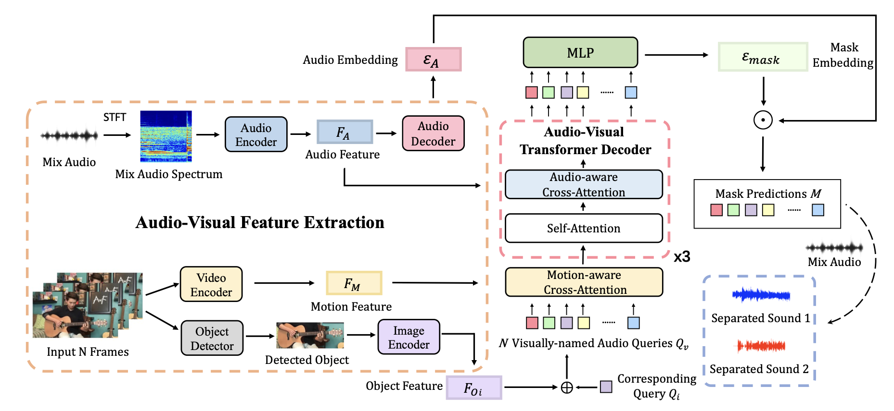

# iQuery: Instruments as Queries for Audio-Visual Sound Separation
Official implementation of [Instruments as Queries for Audio-Visual Sound Separation](https://arxiv.org/abs/2212.03814).
This paper has been accepted by **CVPR 2023**.

## Introduction
We re-formulate visual-sound separation task and propose Instrument as Query (iQuery) with a flexible query expansion mechanism. Our approach ensures cross-modal consistency and cross-instrument disentanglement. We utilize "visually named" queries to initiate the learning of audio queries and use cross-modal attention to remove potential sound source interference at the estimated waveforms. To generalize to a new instrument or event class, drawing inspiration from the text-prompt design, we insert an additional query as an audio prompt while freezing the attention mechanism.

## Code
The code will be released soon.

## Contact
If you have any question about this project, please feel free to contact jic088@ucsd.edu.
